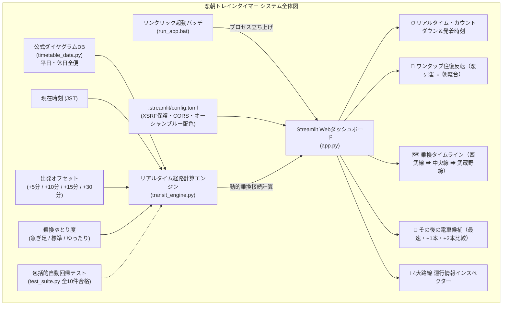

# 🚆 恋朝トレインタイマー (Koiasa Train Timer)

[](https://www.python.org/downloads/)
[](https://streamlit.io/)
[]()
[]()
[]()

西武国分寺線「**恋ヶ窪駅**」と東武東上線・JR武蔵野線「**朝霞台駅（北朝霞駅）**」の間を電車で行き来する際に、**「今の出発時間」「予想される到着時間」「本日の終電案内」をリアルタイム（秒単位）で動的に算出・更新・表示する本格Streamlit Webダッシュボードアプリケーション**です。Google標準の **Material Icons (Material Symbols)** を全面採用し、抜群の視認性と美しさを誇ります。

既存の東証公式J-Quants日本株スクリーナー（`stock-screener`）のシステム構成・セキュリティ規約・品質管理体制に厳密に準拠して設計されています。

---

## 🌟 アプリケーションの特長



1. **完全オフライン対応・超高速ダイヤ計算エンジン**:
   - 外部の有料乗換案内APIや不安定な通信に依存せず、アプリ内に全便のダイヤグラム（西武国分寺線、JR中央線快速、JR武蔵野線）を内包。待ち時間ゼロ・完全無料で安定稼働します。
2. **地中海オーシャンブルー × ニューモーフィズム × すりガラスUI**:
   - スイス・北欧デザインの洗練されたタイポグラフィ（JetBrains Mono × Inter）と、海をモチーフにした清廉なディープブルー配色（`#004B73`）を採用。
   - スマートフォン（360px〜）からPCまで完全レスポンシブ対応。
3. **ワンクリック起動 ＆ 安全な完全停止**:
   - フォルダ内の `run_app.bat` をダブルクリックするだけで自動起動。ウィンドウを閉じればサーバープロセスも即座に完全停止します（PC常駐ゼロ）。
4. **エンタープライズ品質保証（Quality Gate 合格）**:
   - ダイヤ接続・所要時間・エッジケース・XSSサニタイズを検証する包括的ユニットテスト（全10件合格・警告ゼロ）。

---

## 🚀 起動方法

### 方法 1: ワンクリック起動（Windows推奨）
プロジェクトフォルダ内の **`run_app.bat`** をダブルクリックするだけで、自動的に環境が立ち上がりブラウザが開きます。

* **終了方法**: 開いた黒い画面（コマンドプロンプト）の「×」ボタンを押して閉じるだけで、処理が完全に停止します。

### 方法 2: ターミナルからの起動
```bash
# 依存ライブラリのインストール
pip install -r requirements.txt

# Streamlitアプリケーションの起動
python -m streamlit run app.py
```
ブラウザで自動的に `http://localhost:8501` が開きます。

---

## 🎯 主要機能

### 1. リアルタイム発車カウントダウン ＆ 発着予想
* 「発車までの時間」を秒単位で動的に表示（発車2分以内になると警告色へ切り替わり注意喚起）。
* 恋ヶ窪発・朝霞台着（または朝霞台発・恋ヶ窪着）の発車時刻と到着予想時刻を大きく表示。

### 2. ワンタップ往復反転
* 画面上部の「🔄 反転」ボタンを押すだけで、「恋ヶ窪 ➡ 朝霞台」と「朝霞台 ➡ 恋ヶ窪」を瞬時に切り替え。

### 3. 本日の終電案内 ＆ カウントダウン（安心の終電ナビ）
* 夜間の帰宅時に絶対に乗り遅れられない「今日の最終電車（最終連絡便）」の時刻と残り時間をワンタップで確認可能。
* 恋ヶ窪 ➡ 朝霞台（00:03発 ➡ 00:45着）、朝霞台 ➡ 恋ヶ窪（23:45発 ➡ 00:34着）の確実な終電乗り継ぎをフルサポート。

### 4. 出発オフセット ＆ 乗換ゆとり度シミュレーター
* **出発タイミング**: 「今すぐ」「+5分後」「+10分後」「+15分後」「+30分後」から選択可能。身支度中や出発前の計画に最適。
* **乗換ゆとり度**: 「急ぎ足（最短接続）」「標準（おすすめ）」「ゆったり（階段・余裕重視）」の3段階で接続を再計算。

### 5. 乗り継ぎルート詳細（タイムライン）
* 国分寺駅・西国分寺駅での乗換時間・待ち時間をグラフィカルに可視化。Google Material Icons（`train`, `directions_walk`, `signpost`, `info`）により抜群の視認性を実現。
  - **往路**: 恋ヶ窪（西武線: 約3分） ➡ 国分寺（中央線: 約2分） ➡ 西国分寺（武蔵野線: 約22分） ➡ 北朝霞/朝霞台
  - **復路**: 朝霞台/北朝霞（武蔵野線: 約22分） ➡ 西国分寺（中央線: 約2分） ➡ 国分寺（西武線: 約3分） ➡ 恋ヶ窪

### 6. その後の電車候補（比較・選択）
* 最速便だけでなく、「1本後」「2本後」の便もボタンひとつで比較・詳細切り替え可能。

### 7. 関連路線の運行状況・公式リンク
* 西武国分寺線、JR中央線快速、JR武蔵野線、東武東上線の公式運行情報ページへワンクリックでアクセス。

---

## 📂 ディレクトリ構成

```
koiasa-train-timer/
├── app.py                  # メインアプリケーション（Streamlit UI & オーシャンブルー）
├── transit_engine.py       # リアルタイム発着・乗換接続・秒単位計算エンジン & セキュリティ関数
├── timetable_data.py       # 恋ヶ窪・国分寺・西国分寺・北朝霞公式ダイヤグラムデータ
├── test_suite.py           # 包括的自動回帰テストスイート（全10件合格）
├── run_app.bat             # ダブルクリック起動用バッチファイル（Windows標準）
├── requirements.txt        # 依存Pythonパッケージ一覧
├── README.md               # 本ドキュメント
└── .streamlit/
    └── config.toml         # Streamlitテーマ・セキュリティ設定（XSRF保護・CORS・ポート8501）
```

---

## 🛡️ セキュリティ ＆ 品質管理

* **XSS・悪意あるインジェクション防御**:
  画面上に表示されるすべての動的テキストに対して `escape_text()` によるHTML特殊文字エスケープを実施。外部リンクには `is_safe_url()` によるプロトコルサニタイズ（http/https限定）を徹底。
* **通信・ポート保護（`.streamlit/config.toml`）**:
  `enableXsrfProtection = true`（クロスサイトリクエストフォージェリ防止）および `enableCORS = true` を適用。
* **包括的自動回帰テスト**:
  ```bash
  python test_suite.py
  # -> Ran 10 tests in 0.001s / OK (全件合格・警告ゼロ)
  ```
* **開発体制**:
  外資系大手テックコンサル基準の **Webアプリ開発エキスパートチーム（Pod × CoE 17名体制）** によるアーキテクチャ審査会（ARB）および品質判定ゲート（Quality Gate）を通過。

---

## 📜 ライセンス・運行データ免責事項
* 本アプリケーションで提供されるダイヤ情報は、標準運行パターンに基づく推計です。
* 事故・悪天候による遅延や臨時ダイヤ等については、各鉄道会社の公式運行情報をご確認ください。
