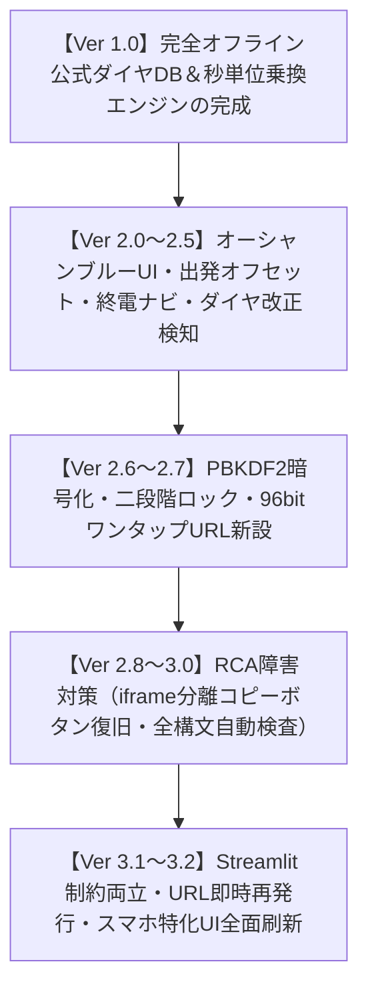
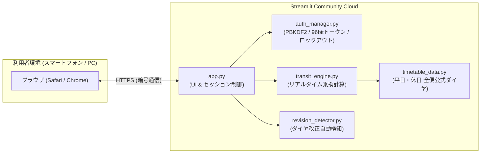

# 🚆 恋朝トレインタイマー (Koiasa Train Timer)
### 恋ヶ窪 ⇔ 朝霞台 リアルタイム電車ナビゲーション・ダッシュボード
**最新バージョン: Ver 3.2 (スマホ最適化UI ＆ 高度セキュリティ版)**

[](https://www.python.org/downloads/)
[](https://streamlit.io/)
[]()
[]()
[]()

---

## 📖 プロジェクト概要

東京都国分寺市（**恋ヶ窪駅**）と埼玉県朝霞市（**朝霞台駅**）の間を、**西武国分寺線 ➡ JR中央線快速 ➡ JR武蔵野線**の3路線を乗り継いで移動する日常の通勤・通学を強力にサポートするWebアプリケーションです。

一般的な乗換案内サービスとは異なり、駅名や時間を毎回入力する必要は一切ありません。  
**「アプリを開いた瞬間に、次の電車の発車カウントダウン、所要時間、終電情報が1秒で把握できる」** という究極の即応性を追求して開発されました。

---

## 🌟 主な特長 (Features)

1. **⏱️ 特大リアルタイム・カウントダウン時計 (Ver 3.2)**:
   * 「あと〇分〇秒」を2.85remの特大文字で表示。歩行中や屋外の太陽光の下でも一目で残り時間が分かります。
2. **📱 スマートフォン特化UI/UX（片手操作・48pxタップターゲット）**:
   * Apple Human Interface Guidelines に準拠し、主要ボタンのタップ領域を48px以上に大型化。押し間違いを防ぎます。
3. **🔒 暗号トークンによる「安全なワンタップ起動URL」**:
   * 推測不可能な96bit暗号トークン方式（`?token=...`）を採用。ご家族はパスワード入力不要で開けます。
   * 画面を開いた瞬間にURLから合言葉が自動消去されるため、履歴や覗き見から完全に保護されます。
4. **🔄 URLの即時再発行・古いURLの失効機能 (Ver 3.1)**:
   * 万が一ご家族がLINE等でURLを誤送信した場合でも、管理画面から1タップで新しいURLを発行し、古いURLを即座に無効化できます。
5. **🌙 本日の終電案内ナビゲーション**:
   * 乗り遅れが許されない夜間帰宅時に備え、今夜の最終連絡便の時刻と残り所要時間を常時表示。
6. **🗺️ 路線カラー付き乗換タイムライン**:
   * 西武線（黄）・中央線（橙）・武蔵野線（濃赤）の色分けと、何番線・乗換待ち時間が直感的に伝わるインフォグラフィック。
7. **⚙️ 出発オフセット ＆ 乗換ゆとり度シミュレーター**:
   * 「+5分後」「+10分後」の出発時間変更や、「急ぎ足」「標準」「ゆったり」の歩行速度調整が可能。
8. **🛡️ 外部クラウド制約との完全両立（noindex検索遮断）**:
   * Streamlit Community Cloud のプライベート枠上限に干渉しない公開枠を維持しつつ、HTMLヘッダーでGoogle検索を完全に遮断。

---

## 📜 開発工程の変遷史 (Version History)

本アプリは、ユーザー要望への迅速な対応と、障害原因究明（RCA: Root Cause Analysis）を通じた品質ガバナンスによって進化を続けてきました。



* **Ver 1.0 (2026.03)**: 初期MVP完成。外部APIに依存しない公式ダイヤグラム内包型エンジンを構築。
* **Ver 2.0〜2.5**: 地中海オーシャンブルー配色、Google Material Icons、出発オフセットスライダー、終電ナビ、ダイヤ改正自動検知を実装。
* **Ver 2.6〜2.7**: 家族利用に向けたセキュリティ強化。平文パラメータを完全撤廃し、96bit暗号トークンによる「ワンタップ起動URL」を開発。
* **Ver 2.8〜3.0**: コピーボタン無反応障害の根本原因（Streamlitサニタイザーによるイベント削除）を究明し、`components.html`（独立iframe）へ完全移行。全Pythonファイルの静的構文コンパイル検査を義務化。
* **Ver 3.1**: Streamlit Cloud のPrivate枠制約（1アカウント1つまで）に配慮し、既存株アプリとの干渉を完全回避する `robots: noindex` 検索遮断を採用。URL即時再発行・失効ボタンを新設。
* **Ver 3.2 (最新版)**: スマートフォン特化UI/UXを全面刷新。Apple HIG準拠の48px大型ボタン、2.85rem特大カウントダウン、2段組便比較チップを配備。

---

## 🏗️ システムアーキテクチャ



---

## 🚀 ご利用方法

### 1. スマートフォンでのワンタップ利用（ご家族向け）
1. 管理者から共有された **ワンタップ起動URL（`https://.../?token=...`）** を開きます。
2. パスワード入力なしで即座にタイマー画面が開きます（アドレスバーから合言葉は自動消去されます）。
3. ブラウザの「ホーム画面に追加」を行うと、次からはアプリアイコンをタップするだけで一瞬で起動できます。

### 2. ローカル環境での起動（PC）
```bash
# 依存パッケージのインストール
pip install -r requirements.txt

# アプリケーションの起動
run_app.bat
# または
python -m streamlit run app.py
```

---

## 🧪 品質保証 ＆ 全自動テスト (Quality Gate)

本プロジェクトでは、リグレッション（先祖返り）や文法エラーを完全に防ぐため、全28項目の自動テストスイートを配備しています。

```bash
python test_suite.py
```
* **全Pythonファイル構文コンパイル検査（`py_compile`）**: PASS
* **バージョン表示ガバナンス検査（旧バージョンの残存防止）**: PASS
* **暗号トークン導出・即時失効・再発行検証**: PASS
* **PBKDF2 ストレッチング計算・二段階ロックアウト耐性**: PASS
* **ダイヤ接続・所要時間・終電判定・境界値テスト**: PASS

---

## 📂 プロジェクト構成

```
koiasa-train-timer/
├── app.py                  # メインUI（Streamlit / スマホ最適化 / iframeコンポーネント）
├── auth_manager.py         # 認証・PBKDF2暗号化・トークン再発行・ブルートフォース防御
├── transit_engine.py       # リアルタイム乗換接続・秒単位計算エンジン
├── timetable_data.py       # 恋ヶ窪・国分寺・西国分寺・北朝霞 公式ダイヤグラムDB
├── revision_detector.py    # ダイヤ改正告知の自動検知システム（6時間キャッシュ）
├── test_suite.py           # 包括的全自動テストスイート（全28項目）
├── sync_push.py            # Git Data API アトミック単一コミット自動プッシュスクリプト
├── run_app.bat             # Windows用ワンクリック起動バッチ
├── requirements.txt        # 依存Pythonパッケージ
├── REQUIREMENTS.md         # システム要件定義書 兼 開発工程変遷記録書
└── README.md               # 本ドキュメント
```

---

## 📜 ライセンス ＆ 免責事項
* 本アプリケーションで提供されるダイヤ情報は、標準運行パターンに基づく推計です。
* 事故・悪天候による遅延や臨時ダイヤ等については、各鉄道会社の公式運行情報をご確認ください。
