# 🚆 恋朝トレインタイマー (Koiasa Train Timer)
## システム要件定義書 兼 開発工程変遷記録書 (Ver 4.0)

---

## 1. プロジェクト概要・開発の背景

### 1.1 開発の背景と目的
東京都国分寺市「恋ヶ窪駅」と埼玉県朝霞市「朝霞台駅」の間は、**西武国分寺線・JR中央線快速・JR武蔵野線**という3つの鉄道会社・路線を跨ぐ移動ルートです。  
既存の大手乗換案内サービス（Yahoo!乗換案内やジョルダン等）では、毎回「出発駅」と「到着駅」を入力・検索する必要があり、**「今すぐ出るべきか？」「あと何分で電車が来るか？」「今夜の終電は何時か？」** を駅のホームや歩行中に片手で瞬時に確認するには手間と時間がかかっていました。

本プロジェクトは、**「画面を開いた瞬間に、現在の駅から次の電車の発車までのカウントダウン・到着予想・終電情報が1秒でわかる」** という極上の利便性を、ご家族で安全かつ快適に日常利用することを目的として開発されました。

---

## 2. 開発工程の変遷史（Ver 1.0 〜 Ver 4.0）

本アプリケーションは、アジャイル開発と障害根本原因究明（RCA: Root Cause Analysis）を繰り返しながら、段階的かつ組織的に進化を遂げてきました。

```mermaid
flowchart TD
    V1["【Phase 1: MVP誕生】<br>Ver 1.0 (2026.03)<br>・完全自己完結ダイヤDB<br>・秒単位乗換計算エンジン<br>・ワンクリック起動bat"]
    
    V2["【Phase 2: UI/UX拡張】<br>Ver 2.0〜2.5<br>・オーシャンブルー×すりガラスUI<br>・出発オフセット(+5/+10分)<br>・終電ナビ＆ダイヤ改正自動検知"]
    
    V3["【Phase 3: セキュリティ強化】<br>Ver 2.6〜2.7<br>・PBKDF2+二段階ロックアウト<br>・96bit暗号トークンURL新設<br>・平文パラメータ完全廃止"]
    
    V4["【Phase 4: RCA＆品質ゲート】<br>Ver 2.8〜3.0<br>・iframe化によるコピー機能復旧<br>・全Python静的構文検査義務化<br>・Git Data API単一コミット反映"]
    
    V5["【Phase 5: モバイル＆運用完成】<br>Ver 3.1〜3.2<br>・Streamlit制約両立(noindex保護)<br>・ワンタップURL即時再発行/失効<br>・スマホ特化UI(48px/2.85rem特大時計)"]

    V6["【Phase 6: 時間連動スマート化】<br>Ver 3.3<br>・時間連動スマートデフォルト<br>・朝(1:00-12:00)は恋ヶ窪発<br>・午後/深夜(12:01-24:59)は朝霞台発"]

    V7["【Phase 7: 洗練デザイン深化】<br>Ver 3.4<br>・Goodpatch流UI/UX全面刷新<br>・統合トップバー<br>・すりガラス調ヒーローカード<br>・メトロインフォグラフィック"]

    V8["【Phase 8: 管理者権限保護】<br>Ver 3.5<br>・ロール分離概念の導入"]

    V9["【Phase 9: 完全ロール分離＆ゼロトラスト】<br>Ver 3.6<br>・初期一般モード起動の完全統一<br>・日常設定欄からの管理操作完全撤去<br>・画面最下部オンデマンド認証<br>・キャッシュ無効化配信"]

    V10["【Phase 10: パスワード完全分離】<br>Ver 3.7<br>・閲覧用PWと管理用マスターPWの二重防壁<br>・管理画面での個別変更UI<br>・後方互換性100%担保"]

    V11["【Phase 11: 欧州サンシャインデザイン深化】<br>Ver 3.8<br>・朝日＆ひまわりのAube Solaire配色<br>・サンライトエクリュ背景<br>・夜明けのテラコッタカード"]

    V12["【Phase 12: 発車後自動次便更新＆駅発車標UX】<br>Ver 3.9 (最新)<br>・三重防護自律更新アーキテクチャ<br>・00秒到達時の即時案内切替<br>・発車2秒後の次便自動スムーズ遷移"]

    V1 --> V2 --> V3 --> V4 --> V5 --> V6 --> V7 --> V8 --> V9 --> V10 --> V11 --> V12
```

### 【フェーズ別・開発経緯の詳細】

| バージョン | 開発フェーズ | 発生した課題・ユーザー要望 | 実施した対策・技術的ブレークスルー | 成果・結果 |
| :---: | :--- | :--- | :--- | :--- |
| **Ver 1.0** | MVP立ち上げ | 外部APIに頼らず、オフラインでも爆速で正確な発着時刻を知りたい | アプリ内に全便の公式時刻表データを完全内包。外部通信ラグゼロ（0.001秒）の独自経路計算エンジンを構築 | 恋ヶ窪⇔朝霞台の往復秒単位計算が完全自己完結で稼働 |
| **Ver 2.0〜2.5** | デザイン＆機能拡充 | スマホで見やすく、急ぎ足や身支度中のシミュレーションをしたい | 地中海オーシャンブルー配色、Google Material Icons、出発オフセットスライダー、終電ナビ、ダイヤ改正自動検知を配備 | 乗換案内の実用性が劇的に向上 |
| **Ver 2.6〜2.7** | 家族向けセキュリティ | 家族にURLを配りたいが、勝手に第三者に覗かれたくない | パスワード認証（PBKDF2・100,000回ストレッチング）＋二段階ロックアウト。さらに平文パスワードURLを完全廃止し、推測不可能な96bit暗号トークン（`?token=...`）によるワンタップ認証を新設 | 家族はパスワード入力不要、外部からは突破不能な防御力を確立 |
| **Ver 2.8〜3.0** | 障害原因究明（RCA）と品質ゲート確立 | コピーボタンが無反応になる不具合、および構文エラーによる画面停止が発生 | **【RCA特定】** Streamlitのサニタイザーが `onclick` を除去していたため `components.html`（独立iframe）へ完全移行。全Pythonファイルの静的構文コンパイル（`py_compile`）をテストスイートに義務化 | ボタンが「✅ コピー完了!」に変化する確実な挙動を実現し、文法エラーを自動検知する強固な品質ゲートを構築 |
| **Ver 3.1** | 外部制約両立＆運用改善 | 家族がURLを誤送信した時の不安。Streamlit CloudのPrivate枠上限（1アカウント1つまで）に既存株アプリがある | リポジトリはPublic枠を維持しつつHTMLに `robots: noindex` を埋め込み完全検索除外。「🔄 共有URLを再発行（古いURLを即座に無効化）」ボタンを新設。難しい設定情報はアコーディオンに目隠し | 既存の株アプリと一切干渉せず、生活圏プライバシー保護とURL誤送信対策を両立 |
| **Ver 3.2** | スマホ特化UI/UX刷新 | 駅のホームや歩行中、片手で見た際により直感的に使いたい | カウントダウンを2.85remの特大文字に拡大。行き先ボタンをApple HIG基準（高さ48px以上・📍ピン付き）に大型化。「その後の電車」を綺麗な2段組チップに整理 | スマホ画面での視認性・片手操作性が飛躍的に向上 |
| **Ver 3.3** | 時間連動スマートデフォルト | 朝は恋ヶ窪発、昼以降は朝霞台発を行き先切り替えなしで即見たい | JST時刻に基づき、1:00〜12:00は「恋ヶ窪 ➡ 朝霞台」、12:01〜24:59（翌0:59）は「朝霞台 ➡ 恋ヶ窪」を初回アクセス時に自動選択するスマートエンジンを配備。手動選択も完全尊重 | 開くだけでその時間に知りたい方面の電車が自動表示され、タップ不要の極上体験を実現 |
| **Ver 3.4** | Goodpatch流洗練デザイン全面深化 | スマホで「使いたい」「洗練されている」と心から思えるデザインにしたい | 人間中心設計（HCD）に基づき、ブランド統合トップバー、すりガラス調ディープオーシャン・ヒーローカード、路線カラーメトロインフォグラフィック、洗練されたフォームUIへ全面刷新 | 圧倒的な視認性と操作美、毎日の通勤が心地よくなるデザインを実現 |
| **Ver 3.5** | 管理者権限保護 | 家族利用時の管理操作の分離 | ロール分離概念を導入 | 家族利用と管理者操作の分離に着手 |
| **Ver 3.6** | 完全ロール分離＆家族安心ゼロトラスト | ログイン直後に管理メニューが丸見えになる問題の解消、家族への完全な安心提供 | パスワードログイン後でも最初は一般モードで起動。日常設定欄から危険な管理フォームを完全撤去し、画面最下部でオンデマンド認証化。キャッシュ無効化配信を配備 | 誤操作の完全防止、安心でクリーンな日常体験と、確実な新バージョン配信を両立 |
| **Ver 3.7** | ログイン・管理者パスワード完全分離 | 家族にパスワードを教えると管理メニューまで操作されてしまう懸念の完全払拭 | ご家族向け「一般ログインパスワード」と「管理者専用マスターパスワード」の二重防壁アーキテクチャを確立。一般パスワードによる管理者メニューへの侵入を遮断し、個別変更フォームと後方互換性を配備 | 家族に気兼ねなくパスワードを共有でき、管理者は完全なガバナンスを維持可能に |
| **Ver 3.8** | 欧州サンシャインデザイン深化 | 奥様のお好きなオレンジ色、朝日とひまわりを連想する爽やかな世界観の実現 | 欧州最先端のウォームモダン・デザイン（Aube Solaire & Tournesol）を導入。サンライト・エクリュ背景、夜明けのテラコッタ・グラデーションカード、ひまわりゴールドのアクセントへ全面刷新 | 毎朝の利用が楽しみになる洗練された美しさと、直射日光下でも一目で見える最高峰の視認性を両立 |
| **Ver 3.9** | 発車後自動次便更新＆駅発車標UX | カウントダウンが0秒で止まり、手動リロードしないと次の便が出ない | クライアント自律JS、Streamlit Fragment、親スクリプト安全弁の「三重防護アーキテクチャ」を実装。00分00秒到達時に「発車しました（次の便へ更新中...）」へ即時切替し、約2秒後に自動リロード | 駅の発車案内板のように画面を開いたまま最新便へ自然に繰り上がり、手動操作不要の完全自律UXを達成 |
| **Ver 4.0** | 終電案内高コントラスト化＆ログイン完全秘匿 | 終電案内の文字が背景と溶けて読みにくい。ログイン画面で駅名や個人情報が露出する不安 | 終電案内に濃色すりガラスバッジ・ゴールド＆ホワイト文字を採用（WCAG AAA達成）。ログイン画面およびブラウザタブから駅名（恋ヶ窪・朝霞台）を完全消去し「プライベートダッシュボード」に抽象化 | 文字がくっきり鮮明に読める抜群の可読性と、第三者から生活圏・行動パターンを一切推測させない鉄壁のプライバシー保護を両立 |

---

## 3. 機能要件一覧 (Functional Requirements)

### 3.1 運行・ダイヤ計算機能
* **時間連動スマートデフォルト判定 (Ver 3.3)**:
  * アプリ起動時、日本標準時（JST）の現在時刻を自動判定。
  * **01:00 〜 12:00**: 出勤時間帯として「恋ヶ窪 ➡ 朝霞台」を自動初期選択。
  * **12:01 〜 24:59 (翌00:59)**: 午後・帰宅・深夜時間帯として「朝霞台 ➡ 恋ヶ窪」を自動初期選択。
  * セッション中はユーザーの手動切り替え（「⇄ 反転」ボタン等）を最優先で維持。
* **双方向ルート検索**:
  * 「恋ヶ窪 ➡ 朝霞台」（西武国分寺線 ➡ JR中央線快速 ➡ JR武蔵野線）
  * 「朝霞台 ➡ 恋ヶ窪」（JR武蔵野線 ➡ JR中央線快速 ➡ 西武国分寺線）
  * 画面上部の大型ボタンまたは「⇄ 反転」ボタンにより瞬時に切り替え可能。
* **リアルタイム・カウントダウン ＆ 発車後自動次便繰り上がり (Ver 3.9)**:
  * 次の電車の発車時刻までの残り時間を「分・秒」でクライアント秒針により動的に表示。
  * **駅発車標UX（00秒即時案内）**: カウントダウンが `00分00秒` に達した瞬間に、バッジ表示を「発車しました（次の便へ更新中...）」へ即時切り替え。
  * **スマートトランジション（三重防護自律リロード）**: 発車から約2秒後、ブラウザJavaScript自律リロード・Streamlit Fragment監視・親スクリプト安全弁の3重機構により、手動操作不要でスムーズに最新便へ自動遷移。過去便が画面に残り続ける問題を物理的に排除。
* **電車の候補比較**:
  * 「★ 最速便」に加え、「+1本後」「+2本後」など複数の運行候補をワンタップで切り替え比較可能。
* **本日の終電案内**:
  * 当日の深夜に乗り継ぎ可能な最終連絡便の時刻と残り所要時間を常時表示。
* **出発オフセット＆ペース設定**:
  * 「今すぐ」「+5分後」「+10分後」「+15分後」「+30分後」の出発シミュレーション。
  * 「急ぎ足（最短）」「標準（おすすめ）」「ゆったり（余裕重視）」の乗換歩行速度選択。
* **ダイヤ改正自動検知**:
  * 各鉄道会社の最新ニュースを6時間ごとにバックグラウンド取得し、改正告知があればバナー通知。

### 3.2 認証・セキュリティ機能
* **管理者権限保護 ＆ ロール分離 (Ver 3.5)**:
  * ご家族に共有する暗号トークンURLでのアクセス時は、セッション状態を `is_admin = False`（一般モード）として起動。
  * 「🔑 パスワードの変更」「🔗 ワンタップ起動URL発行・再発行」「☁️ Secrets設定」を画面上から完全に非表示（隠蔽）化。
  * 管理者パスワード入力画面からのログイン、または設定欄下部の「🔒 管理者メニュー（パスワード認証）」フォームで管理者パスワードを照合した場合のみ `is_admin = True` に安全に昇格。
* **暗号トークン式ワンタップ起動**:
  * 96bitエントロピーの暗号トークン付きURL（`?token=...`）により、家族はパスワード入力不要で直接アクセス可能。
* **URLパラメータ自動消去**:
  * 認証通過と同時にブラウザのアドレスバーからトークンを自動消去（履歴・覗き見防止）。
* **トークン即時失効・再発行**:
  * 管理画面のボタン1つで新しいトークンを発行し、古いURLからのアクセスを即座に全面遮断。
* **ブルートフォース防御**:
  * 連続失敗時に段階的にアプリをロック（5回失敗で30秒、10回失敗で300秒）。
* **検索エンジン完全除外（noindex）**:
  * GoogleやBing等の検索クローラーの巡回・インデックスを完全に遮断。

---

## 4. 非機能要件 (Non-Functional Requirements)

| 項目 | 要件仕様 |
| :--- | :--- |
| **対応端末** | スマートフォン（iPhone Safari, Android Chrome / 360px〜430px）および PCブラウザ |
| **操作性 (UX)** | Apple Human Interface Guidelines 準拠。主要ボタンの最小タップターゲット 48px × 48px 以上 |
| **応答速度** | キャッシュ＆内部DB処理により、画面描画・再計算レスポンス 0.01秒以下 |
| **通信暗号化** | Streamlit Community Cloud による常時 HTTPS (TLS 1.3 / 1.2) 強制 |
| **クラウド制約遵守** | Streamlit Cloud の Free Tier（Private App 1枠上限）に抵触しない公開枠＋検索遮断構成 |
| **テスト自動化** | `test_suite.py` による全28項目以上の単体テスト（構文・暗号・計算・整合性）100%合格 |
| **リリース方針** | Git Data API によるアトミック単一コミットでの安全・確実なデプロイ |
